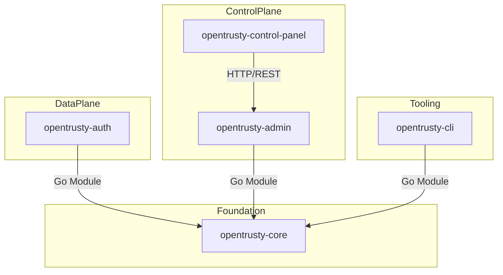

# OpenTrusty Workspace Map

This document provides a high-level overview of the OpenTrusty 5-repository distributed architecture.

## Repository Overview

| Repository | Role | Plane | Primary Tech |
| :--- | :--- | :--- | :--- |
| `opentrusty-core` | Domain Kernel | Infrastructure | Go |
| `opentrusty-auth` | OIDC Gateway | Data Plane | Go |
| `opentrusty-admin` | Management API | Control Plane | Go |
| `opentrusty-cli` | Ops Tooling | Lifecycle | Go |
| `opentrusty-control-panel` | Admin UI | Console | React/TS |

## Dependency Map

## Binary Artifacts

- **authd**: Main daemon for OIDC traffic.
- **admind**: API server for management operations.
- **opentrusty**: CLI for migrations and bootstrap.

## Documented Gaps

- **Test Coverage**: Logic is migrated, but unit and integration tests need to be ported to their respective repos.
- **OpenAPI Consistency**: `admind` and `control-panel` need to synchronize on a shared OpenAPI spec.
- **Versioning**: All repos are currently in pre-release state (v0.0.0).
