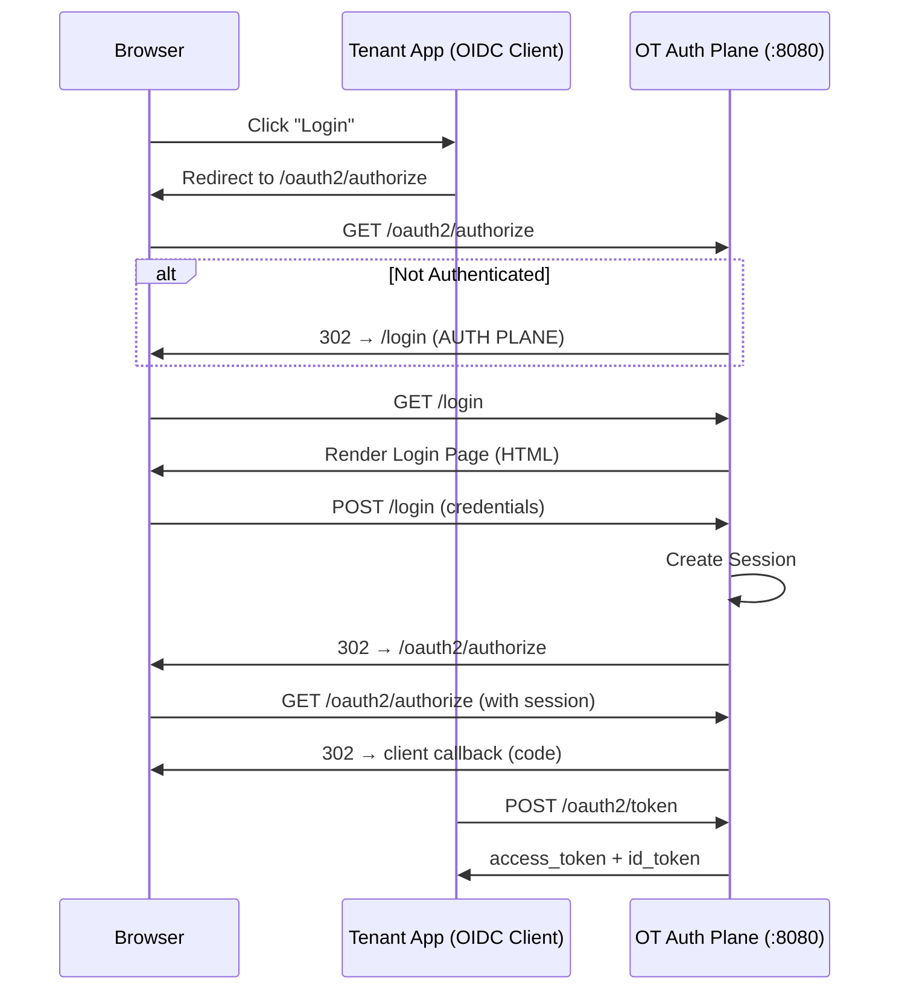

# OpenTrusty Architecture Rules

This document outlines the normative architectural rules for the OpenTrusty project. These rules represent the "constitution" of the system and MUST be followed by all contributors. Failure to adhere to these rules constitutes a rejection criteria for any code change.

## 1. Identity

- **1.1. Persistence**: An **Identity** MUST serve as a persistent, unique representation of an actor within a **Tenant**. It MUST be distinct from the authentication credentials used to verify it.
- **1.2. Decoupling**: An Identity MUST NOT be owned by or coupled to a specific Application (`OAuthClient`). Identities are owned by the **Tenant**.
- **1.3. Uniqueness**: Identity identifiers (e.g., ID, Email) MUST be unique within the scope of their **Tenant**.
- **1.4. Lifecycle**: Identity lifecycle (Creation, Deactivation) MUST be independent of Application lifecycle. Deleting an Application MUST NOT delete its users.

## 2. Tenant

- **2.1. Isolation**: The **Tenant** MUST be the primary security boundary. All data (Users, Sessions, Tokens, configuration) MUST be scoped to a specific Tenant.
- **2.2. Enforcement**: Multi-tenancy MUST be enforced at the persistence layer (Row-Level Security or mandatory `tenant_id` columns). It MUST NOT be a purely logical application-layer filter.
- **2.3. No Cross-Talk**: Data from one Tenant MUST NOT represent, reference, or leak into another Tenant under any circumstance.
- **2.4. Identifier Standards**: 
    - **Format**: All `tenant_id` identifiers MUST be generated by the system as **UUID v7** (RFC 9562).
    - **Canonical Representation**: They MUST be stored and exposed in the canonical 8-4-4-4-12 string format.
    - **Integritiy**: Identifiers MUST NOT be hashed, shortened, or transformed. They MUST be system-generated and immutable once the Tenant is created.
- **2.5. Governance**: Tenant creation is a privileged **Platform-level** administrative action. It MUST be restricted to actors with explicit Platform-scope authorization.

## 3. Protocol (OAuth2 / OIDC)

- **3.1. Standardization**: Authentication MUST be implemented exclusively via standard **OAuth2** and **OpenID Connect** flows. Proprietary login APIs or "magic links" outside these standards SHOULD be avoided unless strictly necessary for bootstrapping.
- **3.2. Strict Compliance**: Implementation MUST adhere strictly to RFC specifications (e.g., exact string matching for `redirect_uri`).
- **3.3. Client Secrets**: `client_secret` MUST NOT be passed in URL parameters. It MUST NOT be logged in plain text. It MUST be stored using cryptographic hashing.
- **3.4. Token Scope**: Access Tokens MUST be scoped to the specific Tenant and Permissions requested. They MUST NOT grant global super-admin privileges unless explicitly scoped for system administration.

## 4. Authorization

- **4.1. Source of Truth**: The Identity Provider (OpenTrusty) MUST serve as the Source of Truth for *assignments* (Who has What Role).
- **4.2. Enforcement point**: The Resource Server (Application) MUST serve as the Point of Enforcement (Is this Role allowed to do X?). The IdP MUST NOT encode granular application-specific permission logic (e.g., "can_click_blue_button").
- **4.3. Reusability**: Roles associated with a Tenant (e.g., "Employee", "Manager") MUST be reusable across multiple Applications. They MUST NOT be hard-coded to a single `OAuthClient`.

## 5. Security

- **5.1. Session Management**: Primary user sessions (Browser Login) MUST be **Stateful** (Database-backed). Stateless tokens (JWT) MUST NOT be used for primary session management due to revocation complexity.
- **5.2. Cryptography**: 
    - Passwords MUST be hashed using **Argon2id**.
    - Weak algorithms (MD5, SHA1, unchecked bcrypt) MUST NOT be used.
- **5.3. Cookies**: All authentication cookies MUST be marked `HttpOnly`, `Secure`, and `SameSite=Lax` (or `Strict`).
- **5.4. Secrets Management**: Secrets (API Keys, Client Secrets, Private Keys) MUST be encrypted at rest or hashed. They MUST NEVER be committed to version control.

## 6. Observability

- **6.1. Structured Logging**: All logs MUST be structured (JSON/Key-Value). Unstructured text logs are forbidden.
- **6.2. Audit Trails**: All security-critical events (Login Success/Failure, Token Issuance, Password Change, Role Assignment) MUST be emitted to the Audit Log.
- **6.3. Audit Context**: Audit events MUST include the **Who** (ActorID), **Where** (TenantID, IP Address), **When** (Timestamp), and **What** (Action/Resource).
- **6.4. Privacy**: Personally Identifiable Information (PII) and Secrets (Passwords, Tokens) MUST be redacted or masked in all logs.

## 7. Development Practices

- **7.1. Clean Architecture**: Business logic MUST reside in the Domain layer (`internal/{domain}`). It MUST NOT leak into the Transport layer (HTTP Handlers).
- **7.2. Dependencies**: The project SHOULD favor the Go Standard Library. External dependencies MUST be justified by significant complexity reduction or security necessity.

## 8. Docs Governance

OpenTrusty documentation is classified into three tiers to ensure clarity of commitment and professional release management:

### 1. Versioned Contract Docs
Documentation that defines the behavior, security properties, and integration contracts of a specific release. Permanent and versioned alongside the code.
- **Location**: `docs/api/`, `docs/architecture/`, `docs/security/`, `docs/fundamentals/`, `docs/domain/`, `docs/deployment/`, `docs/audit/`, `docs/operations/`.
- **Policy**: Must be published per release. Any change to these requires a corresponding logic verification or conscious architectural decision.

### 2. Governance Docs
Documents defining the "rules of the game" and project management.
- **Location**: `docs/governance/`, `GOVERNANCE.md`, `CONTRIBUTING.md`.
- **Policy**: "Latest Only" - reflects current project state and policies regardless of binary version.

### 3. Internal / Historical Docs
Working documents, internal plans, and historical context that are not part of the public product.
- **Location**: `docs/_internal/`.
- **Policy**: Never published to the public documentation site. Used for developer context and audit trails of decision-making.

## 9. System Planes & Deployment Boundaries

OpenTrusty consists of three logical planes, each with distinct responsibilities and deployment characteristics.

### 9.1. Authentication Plane (`auth.*`)
The user-facing authentication surface.
- **Endpoints**: OIDC/OAuth2 protocol endpoints (`/oauth2/authorize`, `/oauth2/token`, `/.well-known/*`)
- **Pages**: End-user login, consent, and error pages (server-rendered)
- **Security Domain**: Highest sensitivity; handles credentials and session cookies
- **Deployment**: Part of the core binary

### 9.2. Management API Plane (`api.*`)
The programmatic administration surface.
- **Endpoints**: REST APIs for tenant, user, client, and policy management
- **Consumers**: Control Panel UI, CLI tools, automation scripts
- **Security Domain**: Admin-scoped; requires authenticated sessions
- **Deployment**: Part of the core binary

### 9.3. Control Panel UI (`console.*`)
The human-facing administrative interface.
- **Technology**: Static SPA (React + TypeScript)
- **Repository**: Separate repository (`opentrusty-control-panel`)
- **Security Domain**: Untrusted client; all enforcement via Management API
- **Deployment**: Separate artifact; NOT embedded in core binary

### 9.4. Normative Constraints

The following constraints are **binding** and MUST be enforced:

| Constraint | Rule |
|------------|------|
| **UI Embedding** | The core repository MUST NOT contain SPA build pipelines, UI routing logic, or static admin UI assets |
| **Binary Scope** | The core binary MUST expose only Authentication Plane and Management API Plane entrypoints |
| **Login Pages** | Login, consent, and brand pages are part of the Authentication Plane and MUST remain server-rendered within the core binary |
| **UI Separation** | The Control Panel UI MUST be deployed as a separate artifact from a separate repository |
| **API Contract** | The Control Panel UI MUST interact with the core ONLY via documented Management API endpoints |

#### 9.4.1. Non-Negotiable Architectural Truths

You MUST internalize and follow these rules. Violations are regressions.

**Plane Separation (Hard Rule)**

| Plane             | Responsibility                                       | Binary                     |
| ----------------- | ---------------------------------------------------- | -------------------------- |
| **Auth Plane**    | OIDC, OAuth2, user authentication, consent, sessions | `opentrusty serve auth`    |
| **Admin Plane**   | Control APIs for platform/tenant/client management   | `opentrusty serve admin`   |
| **Console Plane** | Browser UI only (Control Panel)                      | `opentrusty-control-panel` |

❌ No shared routers
❌ No shared handlers
❌ No `serve all`
❌ No UI logic inside `opentrusty`

#### 9.4.2. OIDC Login Architecture (Authoritative Model)

**Tenant End User Login**

* `/login` **belongs to Auth Plane**
* Login page is **server-rendered HTML** (minimal)
* Control Panel UI is **never involved**
* No AJAX login for tenant users
* No tenant ID passed during login
* Tenant context is resolved **after authentication**, via:

  * memberships
  * OIDC client → tenant binding